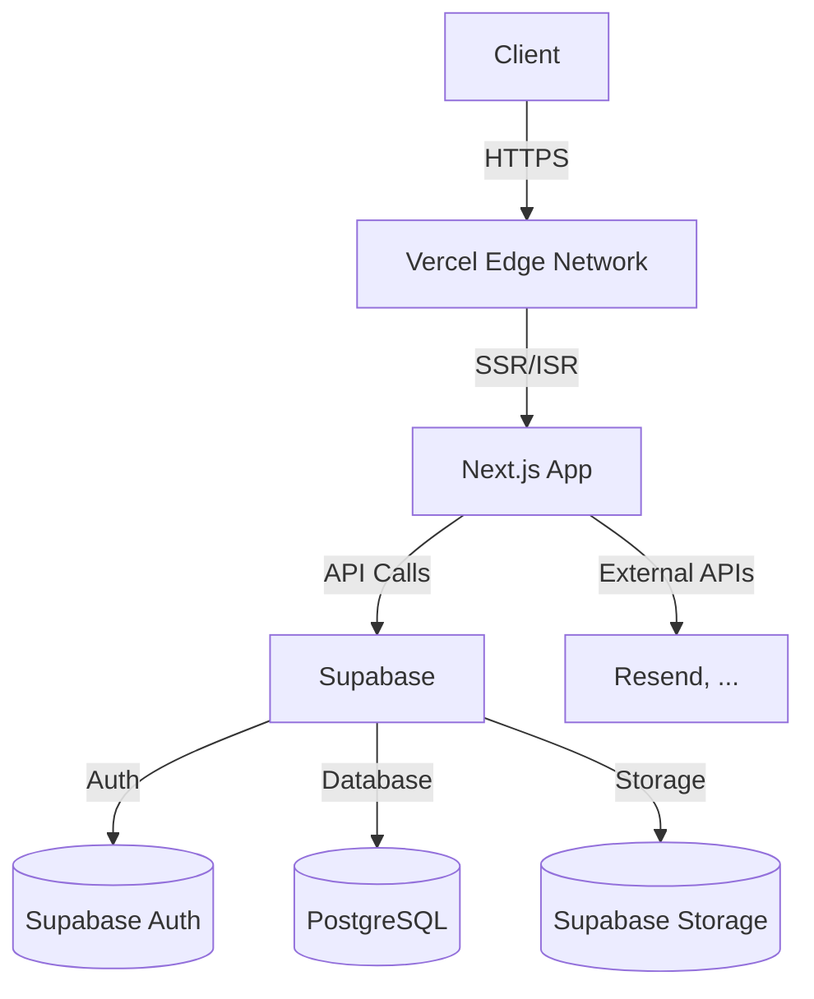

# Kiến trúc Fullstack

## 1. Tổng quan
- **Mục tiêu**: Xây dựng kiến trúc mở rộng, hiệu suất cao cho ứng dụng bán giày B2C
- **Tech Stack**:
  - Frontend: Next.js 15 (App Router), TypeScript, Tailwind CSS, KokonutUI
  - Backend: Next.js API Routes + Server Actions
  - Database: Supabase (PostgreSQL)
  - Authentication: Supabase Auth
  - Storage: Supabase Storage
  - Hosting: Vercel

## 2. Kiến trúc Hệ thống



## 3. Cấu trúc Thư mục

```
src/
├── app/                    # App Router
│   ├── (auth)/            # Auth routes
│   ├── (marketing)/       # Public pages
│   ├── (shop)/            # Product/cart/checkout
│   ├── (admin)/           # Admin dashboard
│   └── api/               # API routes
├── components/
│   ├── ui/                # Reusable UI components
│   ├── products/          # Product components
│   ├── cart/              # Cart components
│   └── checkout/          # Checkout components
├── lib/
│   ├── db/                # Database client/models
│   ├── auth/              # Auth utilities
│   └── utils/             # Helper functions
├── types/                 # TypeScript types
└── styles/                # Global styles
```

## 4. Database Schema

### 4.1 Users
```sql
CREATE TABLE users (
  id UUID PRIMARY KEY DEFAULT uuid_generate_v4(),
  email TEXT UNIQUE NOT NULL,
  full_name TEXT,
  phone TEXT,
  avatar_url TEXT,
  created_at TIMESTAMP WITH TIME ZONE DEFAULT NOW(),
  updated_at TIMESTAMP WITH TIME ZONE DEFAULT NOW()
);
```

### 4.2 Products
```sql
CREATE TABLE products (
  id UUID PRIMARY KEY DEFAULT uuid_generate_v4(),
  name TEXT NOT NULL,
  slug TEXT UNIQUE NOT NULL,
  description TEXT,
  price DECIMAL(10,2) NOT NULL,
  compare_at_price DECIMAL(10,2),
  category_id UUID REFERENCES categories(id),
  featured BOOLEAN DEFAULT false,
  created_at TIMESTAMP WITH TIME ZONE DEFAULT NOW(),
  updated_at TIMESTAMP WITH TIME ZONE DEFAULT NOW()
);

CREATE TABLE product_sizes (
  id UUID PRIMARY KEY DEFAULT uuid_generate_v4(),
  product_id UUID REFERENCES products(id) ON DELETE CASCADE,
  size TEXT NOT NULL,
  stock INTEGER NOT NULL DEFAULT 0,
  sku TEXT,
  UNIQUE(product_id, size)
);

CREATE TABLE product_images (
  id UUID PRIMARY KEY DEFAULT uuid_generate_v4(),
  product_id UUID REFERENCES products(id) ON DELETE CASCADE,
  url TEXT NOT NULL,
  alt_text TEXT,
  position INTEGER DEFAULT 0
);
```

### 4.3 Orders
```sql
CREATE TABLE orders (
  id UUID PRIMARY KEY DEFAULT uuid_generate_v4(),
  user_id UUID REFERENCES auth.users(id) NOT NULL,
  order_number TEXT UNIQUE NOT NULL,
  status TEXT NOT NULL DEFAULT 'pending',
  subtotal DECIMAL(10,2) NOT NULL,
  shipping_fee DECIMAL(10,2) NOT NULL,
  discount_amount DECIMAL(10,2) DEFAULT 0,
  total DECIMAL(10,2) NOT NULL,
  shipping_address JSONB NOT NULL,
  payment_method TEXT NOT NULL,
  payment_status TEXT DEFAULT 'pending',
  created_at TIMESTAMP WITH TIME ZONE DEFAULT NOW(),
  updated_at TIMESTAMP WITH TIME ZONE DEFAULT NOW()
);

CREATE TABLE order_items (
  id UUID PRIMARY KEY DEFAULT uuid_generate_v4(),
  order_id UUID REFERENCES orders(id) ON DELETE CASCADE,
  product_id UUID REFERENCES products(id),
  product_name TEXT NOT NULL,
  product_price DECIMAL(10,2) NOT NULL,
  size TEXT NOT NULL,
  quantity INTEGER NOT NULL,
  total_price DECIMAL(10,2) NOT NULL
);
```

## 5. API Endpoints

### 5.1 Products
- `GET /api/products` - Lấy danh sách sản phẩm
- `GET /api/products/[id]` - Lấy chi tiết sản phẩm
- `GET /api/products/search` - Tìm kiếm sản phẩm

### 5.2 Cart
- `GET /api/cart` - Lấy giỏ hàng
- `POST /api/cart` - Thêm vào giỏ hàng
- `PUT /api/cart/[itemId]` - Cập nhật giỏ hàng
- `DELETE /api/cart/[itemId]` - Xóa khỏi giỏ hàng

### 5.3 Orders
- `POST /api/orders` - Tạo đơn hàng mới
- `GET /api/orders` - Lịch sử đơn hàng
- `GET /api/orders/[id]` - Chi tiết đơn hàng

## 6. Authentication Flow

### 6.1 Đăng nhập/Đăng ký
1. Client gọi `supabase.auth.signInWithPassword()` hoặc `supabase.auth.signUp()`
2. Supabase xử lý xác thực và trả về session
3. Lưu session vào state và cookie
4. Chuyển hướng về trang chủ hoặc trang đích

### 6.2 Bảo vệ Route
```typescript
import { createServerComponentClient } from '@supabase/auth-helpers-nextjs'
import { cookies } from 'next/headers'
import { redirect } from 'next/navigation'

export default async function ProtectedPage() {
  const supabase = createServerComponentClient({ cookies })
  const { data: { session } } = await supabase.auth.getSession()

  if (!session) {
    redirect('/login')
  }
  
  // Render protected content
}
```

## 7. Performance Optimization

### 7.1 Data Fetching
- Sử dụng React Server Components để fetch data ở server
- Implement Incremental Static Regeneration (ISR) cho các trang tĩnh
- Sử dụng `next/image` cho tối ưu hình ảnh

### 7.2 Caching
- Cache API responses với `unstable_cache`
- Sử dụng `revalidateTag` để xác thực cache
- CDN caching thông qua Vercel Edge Network

## 8. Security

### 8.1 Row Level Security (RLS)
```sql
-- Enable RLS on products table
ALTER TABLE products ENABLE ROW LEVEL SECURITY;

-- Allow public read access to products
CREATE POLICY "Public products are viewable by everyone." 
ON products FOR SELECT 
TO anon, authenticated 
USING (true);

-- Restrict product modifications to admins
CREATE POLICY "Products can be modified by admins only"
ON products FOR ALL
TO authenticated
USING (auth.role() = 'authenticated' AND 
       auth.uid() IN (
         SELECT id FROM auth.users 
         WHERE raw_user_meta_data->>'role' = 'admin'
       ));
```

### 8.2 API Security
- Validate tất cả input với Zod
- Giới hạn kích thước request
- Rate limiting cho các endpoint public
- Xử lý lỗi an toàn (không expose thông tin nhạy cảm)

## 9. Deployment

### 9.1 Environment Variables
```env
# Required
NEXT_PUBLIC_SUPABASE_URL=your-supabase-url
NEXT_PUBLIC_SUPABASE_ANON_KEY=your-anon-key

# Optional
RESEND_API_KEY=your-resend-key
NODE_ENV=production
```

### 9.2 Build & Deploy
```bash
# Install dependencies
pnpm install

# Build for production
pnpm build

# Run production server
pnpm start
```

## 10. Monitoring & Logging

### 10.1 Error Tracking
- Sử dụng Sentry cho error tracking
- Log lỗi server-side với Winston
- Theo dõi hiệu năng với Vercel Analytics

### 10.2 Logging Strategy
```typescript
// lib/logger.ts
import { createLogger, format, transports } from 'winston';

const logger = createLogger({
  level: 'info',
  format: format.combine(
    format.timestamp(),
    format.json()
  ),
  transports: [
    new transports.Console(),
    new transports.File({ filename: 'logs/error.log', level: 'error' }),
    new transports.File({ filename: 'logs/combined.log' })
  ]
});

export default logger;
```

## 11. Scaling Considerations

### 11.1 Database
- Thêm chỉ số cho các cột thường dùng để tìm kiếm/lọc
- Sử dụng connection pooling
- Theo dõi và tối ưu các truy vấn chậm

### 11.2 Application
- Implement caching layer (Redis) nếu cần
- Xem xét sử dụng Edge Functions cho các tác vụ nhạy cảm về độ trễ
- Tối ưu bundle size và code splitting

## 12. Tài liệu tham khảo
- [Supabase Documentation](https://supabase.com/docs)
- [Next.js Documentation](https://nextjs.org/docs)
- [Vercel Deployment Guide](https://vercel.com/docs)
